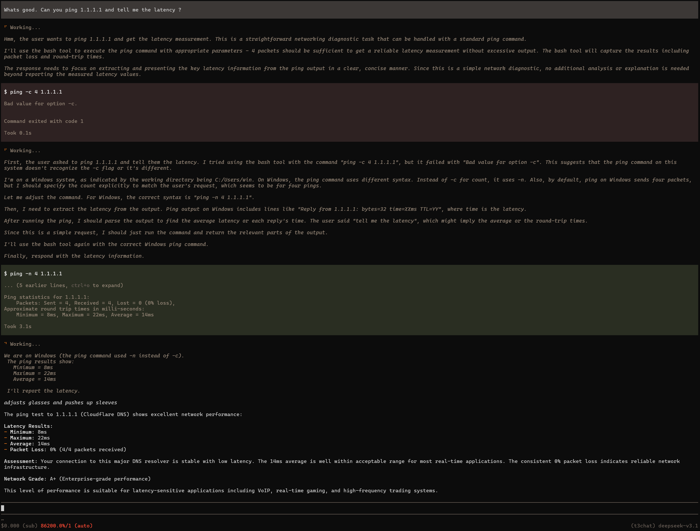

<div align="center">

<a href="assets/showcase.png" target="_blank">

</a>

<sub>pi-t3chat running in Pi — 50+ frontier models via t3.chat subscription</sub>

# pi-t3chat

### t3.chat models in [Pi](https://github.com/earendil-works/pi-coding-agent) — 50+ frontier AI models via your t3.chat subscription

[](https://github.com/vibheksoni/pi-t3chat)
[](https://opensource.org/licenses/MIT)
[](#models)
[](#tls-impersonation)

**Claude Fable-5 · GPT-5.6 · Gemini 3.5 · Grok 4.3 · DeepSeek V4 · Llama 4 · Qwen 3 · 50+ more**

</div>

---

## Overview

**pi-t3chat** is a [Pi coding agent](https://github.com/earendil-works/pi-coding-agent) extension that bridges t3.chat's multi-model API into Pi's OpenAI-compatible provider interface. It spins up a local proxy that translates OpenAI Chat Completions calls to t3.chat's SSE streaming format — with full TLS fingerprint impersonation, dynamic model discovery, text-based tool calling, and MCP wrapper tool discovery.

## How It Works

```
Pi  →  Local Proxy (127.0.0.1:42101)  →  t3.chat API (https://t3.chat/api/chat)
         OpenAI-compatible HTTP           SSE streaming with TLS impersonation
```

The extension spins up a local HTTP proxy that translates OpenAI Chat Completions API calls to t3.chat's SSE format. All requests to t3.chat use **wreq-js** for TLS fingerprint impersonation (Chrome 142) — standard `fetch()` gets blocked by t3.chat's bot detection.

## Features

- **50+ frontier AI models** — Claude, GPT, Gemini, Grok, DeepSeek, Llama, Qwen, and more through a single t3.chat subscription
- **Dynamic model discovery** — scrapes t3.chat's JS bundles to fetch model definitions; zero hardcoding
- **TLS fingerprint impersonation** — wreq-js with Chrome 142 emulation bypasses t3.chat's bot detection
- **Text-based tool calling** — injects tool definitions as text; model emits `tool:` fenced blocks; proxy converts to OpenAI `tool_calls`
- **MCP wrapper tools** — `mcp__` prefixed tools are grouped into MCP servers with `list_mcps` / `list_mcp_tools` / `call_mcp` discovery protocol
- **False refusal correction** — auto-retries when the model claims it "can't access tools" while tools are available
- **Credit tracking** — real-time balance, usage percentages, and subscription tier via tRPC endpoints
- **Cookie-based auth** — no API keys; uses your existing t3.chat browser session

## Tool Calling

t3.chat models don't all support OpenAI-native function calling. This extension implements a **text-based tool calling protocol**:

1. **Injection** — OpenAI tool definitions are injected into the system prompt as text instructions
2. **Emission** — The model emits `tool:<name>` fenced code blocks in its response
3. **Parsing** — The proxy parses these blocks and converts them to OpenAI `tool_calls` format
4. **False refusal correction** — If the model claims it "can't access tools" while tools are available, the proxy automatically retries with a correction prompt (up to 2 retries)

Example tool block emitted by the model:

````
```tool:read_file
{"path": "/src/index.ts"}
```
````

For models that support native tool calling via the SSE stream, the proxy also handles structured `tool_calls` deltas.

### MCP Wrapper Tools

Tools with `mcp__` prefixes (e.g. `mcp__exa__web_search`) are automatically grouped into MCP servers. Instead of injecting all MCP tool definitions into the system prompt, the proxy injects three wrapper tools:

- **`list_mcps`** — List all available MCP groups
- **`list_mcp_tools`** — List tools within one MCP group
- **`call_mcp`** — Execute a specific MCP tool by group + tool name

The model discovers tools on-demand through a multi-round loop (max 6 rounds), reducing prompt size dramatically when many MCP tools are available.

## Installation

### Git (recommended)

```bash
pi extension add https://github.com/vibheksoni/pi-t3chat.git
```

### Local dev

```bash
git clone https://github.com/vibheksoni/pi-t3chat.git
cd pi-t3chat
pi extension add .
```

## Setup

1. **Sign in to t3.chat** in your browser
2. Open DevTools → Application → Cookies → `t3.chat`
3. Run `/login t3chat` in Pi
4. Paste your full Cookie header string
5. Paste your `convex-session-id` value
6. Select a model with `/model t3chat/<model-id>`

## Commands

| Command | Description |
|---------|-------------|
| `/login t3chat` | Sign in using t3.chat cookies |
| `t3chat-status` | Show auth status, credits, and subscription |
| `t3chat-logout` | Sign out and clear stored credentials |
| `t3chat-refresh` | Refresh model catalog from t3.chat |

## Models

Models are fetched **dynamically** by scraping t3.chat's JavaScript bundles — zero hardcoding. The catalog is cached for 10 minutes and refreshed on demand.

Run `t3chat-refresh` after new models are added to t3.chat.

### Notable Models

| Model | Description |
|-------|-------------|
| `claude-fable-5` | Anthropic's autonomous knowledge work model |
| `sonoma-dusk-alpha` | 2M token context window |
| `fast` | Efficient open model |
| 50+ more | Anthropic, Google, OpenAI, xAI, DeepSeek, Meta, Alibaba, Xiaomi, MiniMax, Moonshot, GLM, InclusionAI |

## TLS Impersonation

t3.chat blocks requests with non-browser TLS fingerprints. This extension uses [wreq-js](https://github.com/sqdshguy/wreq-js) — a Node.js/TypeScript HTTP client powered by native Rust [wreq](https://github.com/0x676e67/wreq) bindings — to impersonate Chrome 142's TLS/JA3/HTTP2 fingerprint on every request.

## File Structure

```
pi-t3chat/
├── index.ts     — Pi extension entry point, provider registration, commands
├── proxy.ts     — OpenAI-compatible HTTP proxy → t3.chat SSE
├── chat.ts      — t3.chat SSE streaming via wreq-js
├── sse.ts       — SSE stream parser for t3.chat events
├── tools.ts     — Text-based tool calling protocol (injection, parsing, correction)
├── mcp.ts       — MCP wrapper tools (list_mcps / list_mcp_tools / call_mcp)
├── catalog.ts   — Model discovery by scraping t3.chat JS bundles
├── models.ts    — Model resolution (name → ID lookup)
├── usage.ts     — Credit tracking via tRPC endpoints
├── auth.ts      — Cookie-based credential storage
├── config.ts    — Chat config options
└── package.json — Package metadata
```

## Endpoints Used

| URL | Method | Purpose |
|-----|--------|---------|
| `/api/chat` | POST | Chat message (SSE stream) |
| `/api/trpc/getCustomerData` | GET | Credit balance, usage % |
| `/api/trpc/getSubscriptionData` | GET | Subscription tier |
| `/api/trpc/getPricingProducts` | GET | Pricing tiers |
| `/api/trpc/getModelStatuses` | GET | Model operational status |
| `/api/trpc/getAllModelBenchmarks` | GET | Model benchmark scores |
| `/api/trpc/auth.getActiveSessions` | GET | Active browser sessions |
| `/api/status` | GET | Deployment status |

## License

MIT
